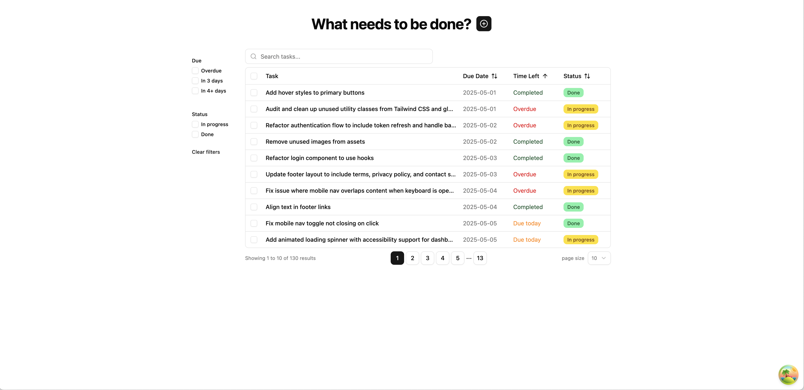

# To-Do List Application



## Todo app 주요 기능
- 새 todo를 추가 할 수 있습니다
  - App 타이틀 ("What needs to be done?") 옆에 있는 `+` 버튼을 클릭하면 새 todo 추가 dialog가 열립니다
  - 추가하려는 todo의 텍스트와 데드라인을 입력받습니다
    - 텍스트는 필수 입력값입니다
      - 입력하지 않고 추가하려고 하면, 해당 validation 에러 메시지가 나타납니다
    - 데드라인 또한 필수 입력값입니다
      - 처음에는 선택 입력으로 하려 했으나, 입력을 안 했을 시 default 값 설정 (`ToDo['deadline']` 타입이 `undefined`|`null`을 허용하지 않는 `number`값으로 정의 되어 있습니다) 및 todo list에 표출하기가 애매해서 필수 입력값으로 변경 했습니다
      - 과거 날짜 (오늘 이전 날짜)는 선택할 수 없도록 설정 되어 있습니다
    - 완료 여부 입력란은 새로 추가 할 때는 disabled 되어 있습니다
      - 업데이트 시에는 활성화 됩니다
- 추가한 todo를 수정 할 수 있습니다
  - 새 todo 추가 form dialog와 동일한 dialog을 통해 수정 할 수 있고, 수정 가능한 항목은 다음과 같습니다:
    - 텍스트
    - 데드라인
    - 완료여부
  - todo list table의 각 row를 클릭하면 수정 dialog가 열립니다
- 추가한 todo를 삭제 할 수 있습니다
  - 테이블의 체크박스를 통해 하나 또는 여러개의 todo를 선택하여 삭제할 수 있습니다 (테이블 헤더의 체크박스를 통해 전체 선택/해제가 가능합니다)
- todo 검색이 가능합니다
  - 검색어 입력란의 값을 include하는 todo를 필터 합니다
    - ex) "favicon"을 입력하면 "Update **favicon** with new branding", "Add **favicon** to all pages", "Ensure **favicon** loads correctly across all routes and browsers using appropriate link tags" 등의 텍스트를 가진 todo가 필터링 됩니다
  - 검색어 값 변화에 대한 debounce (500ms)가 적용되어 있습니다
  - debounced된 검색어 값이 변할 때마다, url의 search parameter의 `q`의 값을 업데이트 합니다
    - 이로 인해, 브라우저 새로 고침, 링크 공유 등을 해도 검색어 및 필터가 적용 됩니다
  - 현재 검색어 값을 지울 수 있는 x버튼이 인풋 오른쪽에 있습니다 
    - url search parameter의 `q`의 값도 지워집니다
    - 인풋값이 있을때만 x버튼이 보입니다
- todo list table의 컬럼 정렬이 가능합니다
  - default로 남은 기간을 표시해주는 컬럼인 `Time Left`가 오름 차순으로 정렬 되어 있습니다. 즉, 남은 시간이 적은 순서로 정렬 되어 있습니다
- todo list table의 row들을 filter 할 수 있습니다
  - 남은 시간에 따라, '기한 지남 (Overdue)', '기한 3일 이내 (In 3 days)', '기한 3일 초과 (In 4+ days)'로 필터링 할 수 있습니다
  - 완료 여부에 따라서도 필터가 가능합니다
  - 현재 적용된 필터를 지울 수 있는 `Clear filters` 버튼이 있습니다
- todo list table에 pagination이 적용되어 있습니다
  - 한 페이지에 보여질 todo의 개수를 (5, 10, 20) 중에서 선택 할 수 있습니다 (default: 10)

## 구현에 사용된 기술 스택
- UI components & styling
  - [shadcn/ui](https://ui.shadcn.com/)
  - [Radix Primitives](https://www.radix-ui.com/primitives/docs/overview/introduction)
  - [tailwindcss](https://tailwindcss.com/)
  - [React DayPicker v8](https://daypicker.dev/v8) & [date-fns](https://date-fns.org/)
    - 달력 컴포넌트 및 날짜 processing
  - [Sonner](https://sonner.emilkowal.ski/)
    - 토스트 컴포넌트
  - [TanStack Table](https://tanstack.com/table/latest)
    - 테이블 컴포넌트
      - client-side sorting, filtering, pagination
      - row selection
- Web Forms
  - [shadcn/ui Form](https://ui.shadcn.com/docs/components/form)
    - [React Hook Form](https://react-hook-form.com/)
    - [Zod](https://zod.dev/)
- Data fetching & state management
  - [TanStack Query](https://tanstack.com/query/latest/docs/framework/react/overview)
- Testing & other tools
  - [Vitest](https://vitest.dev/)
  - [Playwright](https://playwright.dev/)
      - 직접 사용하지 않고, Vitest의 browser mode의 provider로 간접적으로 사용
  - [Storybook](https://storybook.js.org/)

## 프로젝트 주요 커맨드
- `pnpm dev`
  - vite dev server 실행 및 app 구동
- `pnpm storybook`
  - storybook 실행
- `pnpm test`
  - vitest test 실행
    - `CI=true` 로 설정하여, watch 모드로 실행되지 않음
    - browser mode로 실행되는 테스트들 (`*.browser.test*.`) 을 headless 모드로 실행
    - `.husky/pre-commit` hook에 설정되어 있어, commit 시 자동으로 실행 됨
- `pnpm vitest`
  - vitest test 실행
    - watch 모드로 실행됨
    - browser mode로 실행되는 테스트들 (`*.browser.test*.`) 을 playwright의 chromium browser로 실행 하고, vitest ui에서 iframe형태로 확인 가능

## 프로젝트 구조
- `.husky/`
  - git의 pre-commit hook (`.husky/pre-commit`) 으로 `pnpm test`를 실행하기 위해 [Husky](https://typicode.github.io/husky/)를 사용
- `.storybook/`
  - storybook 관련 config 폴더
  - 현재 디폴트 값만 사용
- `tests/`
  - vitest test 관련 폴더
  - 굳이 browser 환경이 필요하지 않는 테스트들은 파일명을 `*.node.test.*`로 설정하여 node 환경에서 실행 되도록 함
  - browser 환경이 필요한 테스트들의 경우 파일명을 `*.browser.test.*`로 설정하여 vitest browser mode를 통해 playwright의 chromium browser에서 실행 되도록 함
  - `vite.config.ts`의 `config.test.workspace` 에서 이런식으로 환경 분할을 함
  - [Vitest/Workspace](https://vitest.dev/guide/workspace) 참조
- `vitest.browser.setup.ts`
  - vitest browser mode에서 실행되는 테스트들을 실행하기 전에 먼저 실행되는 스크립트
  - msw worker 구동 및 css import를 함
- `.env`
  - `VITE_INITIAL_DATA` 환경변수를 통해 초기 데이터 반영 여부를 정할수 있다
  - 테스트 환경에서는 항상 `setToDos(INITIAL_TODOS)` 를 실행 함
    - `vitest.browser.setup.ts` 참조
  - 이를 위해 `src/mocks/handlers.ts` 에서 `setToDos`를 export 하도록 변경함
```tsx
// src/main.tsx
if (import.meta.env.VITE_INITIAL_DATA === 'true') {
  setToDos(INITIAL_TODOS)
} else {
  setToDos([])
}
```
- `src/`
  - `src/components/`
    - `src/components/ui/`
      - shadcn/ui 컴포넌트가 설치되는 default 폴더
        - ex) `pnpm dlx shadcn@latest add button` 실행 시, `src/components/ui/button.tsx`에 button 컴포넌트가 생성됨
      - 기본 설치된 shadcn/ui 컴포넌트들의 style 및 행동을 customize 하기 위해 `*.stories.tsx` 파일들을 생성하여, customize 실험을 함
      - storybook을 다른 부서 (예: 디자인팀) 과 공유하려는 목적 보다는, 각 컴포넌트를 isolated environment에서 이것 저것 실험 하기 위해서 사용함
    - `src/components/*`
      - `./ui/` 폴더안의 컴포넌트들을 조합하고 data fetching 등 비즈니스 로직들이 포함된 더 큰 단위의 컴포넌트들
      - `TaskTable` 컴포넌트의 경우, `useReactTable()` 의 return 값인 `table`이 거의 모든 테이블 관련 상태 (정렬, 필터링, pagination 등) 를 관리하고 있어서, 기능단위 (필터, 페이지네이션, 검색 등) 로 컴포넌트를 분할 하고, `table` 객체를 props로 넘겨주는 방식으로 리팩토링 함
  - `src/lib/`
    - `const.ts`
        - 앱 구동시 한번만 실행되면 되는 상수값들을 모아놓은 파일
    - `duration.ts` & `pagination.ts`
      - node 환경에서도 실행 되는 pure function들
      - 테스트 또한 node 환경에서 실행되어 굉장히 빠름 (2-3ms)
        - 브라우저 테스트들은 총 5700ms 정도 걸림
      - TaskTable의 `Time Left` 컬럼의 cell값 계산 및 테이블 pagination 버튼 index를 계산함
    - `fetch.ts`
      - Web fetch API를 사용하여 서버와 통신하는 함수들
      - 보통 컴포넌트안의 `useQuery()` 의 `queryFn` 또는 `useMutation()` 의 `mutationFn` 으로 사용됨
    - `utils.ts`
      - `shadcn/ui`에서 생성한 `classNames`을 merge해주는 함수인 `cn`을 export 함
      - `twMerge` 가 필요한 이유는, `props.className` 이 이미 정의되어있는 컴포넌트의 tailwindcss 클래스들을 overwrite 할 수 있게 해주기 때문
      - [tailwind-merge docs](https://github.com/dcastil/tailwind-merge/blob/v3.2.0/docs/what-is-it-for.md) 참조
```tsx
import { twMerge } from 'tailwind-merge'

twMerge('px-2 py-1 bg-red hover:bg-dark-red', 'p-3 bg-[#B91C1C]')
// → 'hover:bg-dark-red p-3 bg-[#B91C1C]'
```